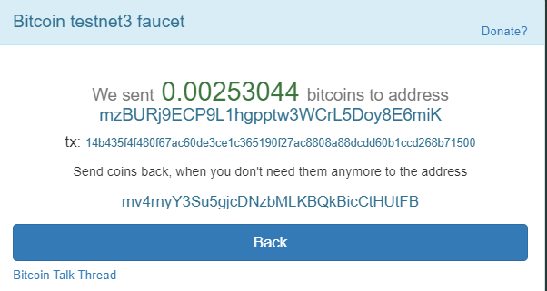

Edit task1.py inorder to use:
1) Replace **address**, **private_key** with your bitcoin testnet address & private key (P2PKH Address recommended).
2) Replace **destination_address** with your desired receiver's bitcoin testnet address.
3) Replace **txid**, **output_index** with a transasaction id and index of target unspent transaction output (UTXO)
4) Replace **amount_to_send** with your desired amount in Satoshi, make sure the amount is not exceed value of the target UTXO.

### Run the command:
```
python3 task1/task1.py
```


### Test result:

Sender's P2PKH address: 
```
mzBURj9ECP9L1hgpptw3WCrL5Doy8E6miK
```

Receiver's P2PKH address: 
```
mv4rnyY3Su5gjcDNzbMLKBQkBicCtHUtFB
```

Faucet's transaction ID: 
```
14b435f4f480f67ac60de3ce1c365190f27ac8808a88dcdd60b1ccd268b71500
```




Code output (Sender-to-Receiver's transaction hex value, to be broadcasted):

> 01000000010015b768d2ccb160dddc888a80c87af29051361ccee30dc67af680f4f435b414010000006b4830450221009d8f0c126447eed423ffafd3cf548465fcb32cadfa247f3f02caf1e1518c43a90220414228aba2e1c364dbc4c74a4626851d36639478ce55c0276c137938ce4b6ea101210267f28e66f82d15bdf8439701a4b3009e6213b1c559d1253c15937ff1145b4d1cffffffff0190d00300000000001976a91438320f687a0532ff66f2cd5860927b7c264d530688ac00000000

Sender-to-Receiver's transaction ID:
```
ce0b0c5d9244c44883f3465fa9683c19423316ab838f5fb1e1c8327d8c68d984
```
Transaction is verified
